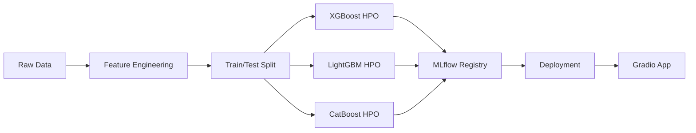

# ⚡ European Energy Load Forecasting - Multi-Model MLOps Pipeline

[](https://github.com/AliBaghizadeh/CICD-for-machine-learning/actions)
[](https://huggingface.co/spaces/alibaghizade/time_series_energy)

---

## 📖 About This Project

This project tackles the critical challenge of **short-term energy load forecasting** for European power grids, using over **800,000 hours** of historical energy consumption data from 10 European countries (Austria, Germany, France, Italy, Belgium, Switzerland, Netherlands, Poland, Czech Republic, and Spain). Accurate energy forecasting is essential for grid stability, cost optimization, and renewable energy integration. The dataset includes hourly energy loads (in megawatts), weather conditions (temperature and solar radiation), and temporal patterns spanning multiple years, making it an ideal testbed for advanced time-series machine learning techniques.

To solve this problem, I built a **production-grade MLOps pipeline** that goes far beyond simple model training. I selected three state-of-the-art gradient boosting algorithms—**XGBoost, LightGBM, and CatBoost**—each known for their exceptional performance on tabular data and time-series forecasting. Rather than settling for default parameters, I implemented **Bayesian hyperparameter optimization using Optuna**, running 20 trials per model (60 total experiments) to systematically search through parameter spaces and identify optimal configurations. This optimization process leveraged **GPU acceleration**, reducing training time from hours to minutes while exploring learning rates, tree depths, regularization parameters, and sampling strategies. The entire experimentation process was tracked using **MLflow**, a self-hosted server deployed on **AWS EC2** with **S3 artifact storage** and **PostgreSQL metadata store**, enabling complete reproducibility and model versioning. Finally, I deployed the best-performing models to a **Gradio web application** hosted on **HuggingFace Spaces**, creating an interactive interface where users can compare predictions from all three models in real-time. The entire workflow is automated through **GitHub Actions CI/CD pipelines**, ensuring that every code change triggers model retraining, performance evaluation, and automatic deployment—demonstrating enterprise-level MLOps practices from data to deployment.

---

## 🎯 Overview

A production-ready MLOps pipeline for forecasting hourly energy consumption across **10 European countries** using **3 optimized gradient boosting models**. This project demonstrates end-to-end machine learning lifecycle management with automated CI/CD, experiment tracking, and model registry.

### 🌟 Key Features

- **Multi-Model Comparison**: XGBoost, LightGBM, and CatBoost trained and optimized independently
- **GPU-Accelerated Training**: Hyperparameter optimization using Optuna on NVIDIA RTX 5080
- **MLflow Integration**: Complete experiment tracking and model registry
- **Automated CI/CD**: GitHub Actions pipeline with continuous deployment to HuggingFace
- **Interactive Demo**: Gradio web app comparing predictions from all 3 models

### 📊 Model Performance

| Model | MAE (MW) | Status | GPU Acceleration |
|-------|----------|--------|------------------|
| **XGBoost** | 92.81 | 🥇 Best | CUDA |
| **LightGBM** | 93.42 | 🥈 | CPU (Windows compatible) |
| **CatBoost** | 124.74 | 🥉 | GPU |

*All models optimized with 50 Optuna trials on 800K+ rows of European energy data*

## 🚀 Live Demo

Try the deployed application: **[European Energy Forecasting App](https://huggingface.co/spaces/alibaghizade/time_series_energy)**

The app provides:
- Side-by-side predictions from all 3 models
- Real-time energy load forecasting for 10 European countries
- Performance metrics comparison
- Interactive parameter adjustment

## 🧠 Technical Architecture

### Machine Learning Pipeline



### Feature Engineering

Advanced time-series features including:
- **Cyclical encoding**: Hour, day of week, month (sin/cos transformations)
- **Lagged features**: 15min, 1hr, 1day, 1week lags
- **Weather data**: Temperature, solar radiation
- **Calendar features**: Holidays, weekends
- **Country encoding**: One-hot encoding for 10 European countries

### Hyperparameter Optimization

Each model was independently optimized using **Optuna** with:
- 50 trials per model (150 total trials)
- Time-series cross-validation (3 splits)
- GPU acceleration where available
- Bayesian optimization for efficient search

## 📁 Project Structure

```
├── .github/workflows/
│   ├── ci.yml                    # Continuous Integration
│   └── cd.yml                    # Continuous Deployment
├── App/
│   └── energy_app.py             # Gradio multi-model comparison app
├── Data/
│   └── train-00000-of-00001.parquet  # European energy dataset
├── Model/                        # Trained models (gitignored, too large)
│   ├── xgboost_model.pkl
│   ├── lightgbm_model.pkl
│   ├── catboost_model.pkl
│   ├── scaler.pkl
│   └── best_params.txt
├── Results/
│   ├── metrics.txt               # Performance metrics
│   ├── model_results.png         # Visualization
│   └── notebook.ipynb            # EDA and prototyping
├── train.py                      # Single model training (CI/CD)
├── train_hpo.py                  # Multi-model HPO script
├── register_models.py            # MLflow model registration
├── check_gpu.py                  # GPU verification utility
├── Makefile                      # Automation commands
└── requirements.txt              # Python dependencies
```

## 💻 Getting Started

### Prerequisites

- Python 3.10+
- CUDA-capable GPU (optional, for faster training)
- Git

### Installation

```bash
# Clone the repository
git clone https://github.com/AliBaghizadeh/CICD-for-machine-learning.git
cd CICD-for-machine-learning

# Install dependencies
pip install -r requirements.txt
```

### Local Development

#### 1. Train a Single Model (Quick)
```bash
python train.py
```

#### 2. Run Hyperparameter Optimization (All 3 Models)
```bash
python train_hpo.py
```
*Note: This will take 10-20 minutes with GPU acceleration*

#### 3. Register Models in MLflow
```bash
python register_models.py
```

#### 4. Launch MLflow UI
```bash
mlflow ui
```
Open `http://localhost:5000` to view experiments and models

#### 5. Test the Gradio App Locally
```bash
python App/energy_app.py
```
Open `http://localhost:7860` to interact with the app

### Using Makefile

```bash
make install        # Install dependencies
make train          # Train single model
make hpo            # Run hyperparameter optimization
make register-models # Register models in MLflow
make mlflow-ui      # Launch MLflow UI
```

## 🔄 CI/CD Pipeline

### Continuous Integration (CI)

Triggered on every push to `main`:
1. ✅ Code checkout
2. ✅ Environment setup
3. ✅ Dependency installation
4. ✅ Model training
5. ✅ Performance evaluation
6. ✅ Results reporting (CML)

### Continuous Deployment (CD)

Triggered after successful CI:
1. ✅ Checkout `update` branch
2. ✅ Install dependencies
3. ✅ Deploy to HuggingFace Space
   - App code (`energy_app.py`)
   - Requirements
   - Model files
   - Metrics

## 📊 MLflow Integration

### Experiment Tracking

All training runs are logged to MLflow with:
- Hyperparameters (learning rate, max depth, etc.)
- Metrics (MAE, R²)
- Artifacts (plots, model files)
- System info (GPU, CPU, memory)

### Model Registry

Models are versioned and tagged:
- **Production**: Best performing model
- **Staging**: Models under evaluation
- **Archived**: Previous versions

Access the registry:
```bash
mlflow ui
# Navigate to "Models" tab
```

## 🛠️ Technologies Used

| Category | Tools |
|----------|-------|
| **ML Frameworks** | XGBoost, LightGBM, CatBoost, scikit-learn |
| **Optimization** | Optuna |
| **Experiment Tracking** | MLflow |
| **Web Framework** | Gradio |
| **CI/CD** | GitHub Actions, CML |
| **Deployment** | HuggingFace Spaces |
| **Data Processing** | Pandas, NumPy |
| **Visualization** | Matplotlib, Seaborn |

## 📈 Dataset

**Source**: European energy consumption data (800K+ rows)

**Features**:
- Timestamp (hourly resolution)
- Energy load (MW)
- Temperature (°C)
- Solar radiation
- Country ID (AT, DE, FR, IT, BE, CH, NL, PL, CZ, ES)

## 🎯 Future Improvements

- [ ] Implement continuous model monitoring
- [ ] Add SHAP explainability
- [ ] Integrate external weather APIs
- [ ] Deploy to cloud (AWS/Azure/GCP)
- [ ] Add model ensemble predictions
- [ ] Implement A/B testing framework

## 📝 License

This project is licensed under the MIT License.

## 👤 Author

**Ali Baghizadeh**
- GitHub: [@AliBaghizadeh](https://github.com/AliBaghizadeh)
- HuggingFace: [@alibaghizade](https://huggingface.co/alibaghizade)

## 🙏 Acknowledgments

- European energy dataset providers
- MLflow and Optuna communities
- HuggingFace for free hosting
- AWS S3 and EC2 free access

---

⭐ **Star this repo** if you find it useful!
